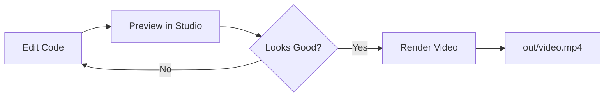

# 📊 Data Visualization Projects

A collection of professional data visualization video projects built with **Remotion**, **React**, **D3.js**, and **TypeScript**.

---

## 🎯 About This Repository

This monorepo contains multiple data visualization projects, each creating stunning animated videos from data. All projects use modern web technologies to generate high-quality MP4 videos suitable for YouTube, social media, and presentations.

---

## 📁 Projects

### 1. [01-Top30DistrictsInOdisha](./01-Top30DistrictsInOdisha)
**Odisha Population Visualization**

A 2-minute animated bar chart video showcasing the top 15 districts in Odisha by population.

- 🎨 **15 vibrant gradient colors**
- 📊 **Animated bar charts** with sequential reveals
- 🏆 **Medal podium** for top 3 districts
- 📈 **Live statistics panel** with real-time data
- 🎬 **Professional scenes**: Title → Chart → Ending

**Tech Stack:** Remotion 4.0, React 19, D3.js 7.9, TypeScript 5.6

[→ View Project Details](./01-Top30DistrictsInOdisha/README.md)

---

## 🚀 Quick Start

Each project is self-contained with its own dependencies and setup.

### General Setup

1. **Prerequisites:**
   - Node.js v18 or higher ([Download](https://nodejs.org/))
   - Git ([Download](https://git-scm.com/))

2. **Clone the repository:**
   ```bash
   git clone <your-repo-url>
   cd data-viz
   ```

3. **Navigate to a project:**
   ```bash
   cd 01-Top30DistrictsInOdisha
   ```

4. **Install and run:**
   ```bash
   npm install
   npm start
   ```

---

## 🛠️ Tech Stack

All projects in this repository use:

| Technology | Purpose |
|-----------|---------|
| **Remotion** | Video rendering framework |
| **React** | Component-based UI |
| **TypeScript** | Type-safe development |
| **D3.js** | Data visualization & scales |
| **Node.js** | Runtime environment |

---

## 📂 Repository Structure

```
data-viz/
├── 01-Top30DistrictsInOdisha/     # Odisha districts population viz
│   ├── src/                        # Source code
│   ├── public/                     # Data files
│   ├── out/                        # Rendered videos
│   ├── README.md                   # Project documentation
│   ├── SETUP_WINDOWS.md           # Windows setup guide
│   ├── SETUP_MAC.md               # Mac setup guide
│   └── package.json               # Dependencies
│
├── 02-YourNextProject/            # Future project
├── 03-AnotherProject/             # Future project
│
├── README.md                       # This file
└── .gitignore                     # Git ignore rules
```

---

## 🎨 Common Features

All projects in this repository share:

✅ **Professional Quality**
- Full HD 1920×1080 resolution
- 30 FPS smooth animations
- H.264 MP4 output

✅ **Modern Design**
- Clean typography
- Vibrant color palettes
- Smooth transitions
- Spring physics animations

✅ **Easy Customization**
- Centralized theme system
- Simple data format (CSV)
- Well-documented code
- Modular components

✅ **Developer Experience**
- Hot reload in preview
- TypeScript type safety
- Clear project structure
- Comprehensive guides

---

## 🎬 Workflow

Each project follows the same workflow:



1. **Edit** - Modify colors, data, or animations
2. **Preview** - See changes live with `npm start`
3. **Render** - Create final video with `npm run render`

---

## 📋 Project Template

Each project contains:

```
ProjectName/
├── src/
│   ├── *.tsx              # React components
│   ├── theme.ts           # Colors & styling
│   ├── dataLoader.ts      # Data utilities
│   └── index.ts           # Entry point
├── public/
│   └── *.csv              # Data files
├── README.md              # Project docs
├── SETUP_WINDOWS.md       # Windows guide
├── SETUP_MAC.md           # Mac guide
└── package.json           # Dependencies
```

---

## 🎯 Use Cases

These visualizations are perfect for:

- 📊 **Data Presentations** - Professional storytelling
- 🎓 **Educational Content** - Engaging explanations
- 📱 **Social Media** - Viral-ready content
- 📺 **YouTube Videos** - Subscriber engagement
- 💼 **Business Reports** - Impressive dashboards
- 🎤 **Conference Talks** - Memorable slides

---

## 💡 Contributing

Want to add a new project?

1. Create a new folder: `0X-YourProjectName/`
2. Copy the structure from an existing project
3. Update this README with project details
4. Submit a pull request

---

## 📚 Learning Resources

- **Remotion**: https://www.remotion.dev/docs/
- **React**: https://react.dev/
- **D3.js**: https://d3js.org/
- **TypeScript**: https://www.typescriptlang.org/

---

## 🔧 Common Commands

```bash
# Preview any project
cd <project-folder>
npm install
npm start

# Render video
npm run render

# High quality render
npm run render -- --crf 18

# Fast preview render
npm run render -- --crf 28
```

---

## 🐛 Troubleshooting

### Port already in use
```bash
npx kill-port 3000
```

### Clear cache
```bash
rm -rf node_modules package-lock.json
npm install
```

### Check for errors
```bash
npx tsc --noEmit
```

For project-specific issues, see the project's README.

---

## 📊 Project Status

| Project | Status | Duration | Resolution |
|---------|--------|----------|------------|
| 01-Top30DistrictsInOdisha | ✅ Complete | 2:00 | 1920×1080 |
| 02-YourNextProject | 🔄 Coming Soon | - | - |
| 03-AnotherProject | 🔄 Coming Soon | - | - |

---

## 🎨 Color Palettes

### Odisha Project
```
Background: #FBEFEF (Pink Cream)
Primary:    #1B4965 (Navy Blue)
Accent:     #FF6B35 (Orange)
Success:    #10B981 (Green)
```

---

## 📈 Performance Notes

Typical rendering times (Full HD, 2 minutes):

| Hardware | Time |
|----------|------|
| M1/M2/M3 Mac | 25-35 min |
| Intel Mac | 40-50 min |
| Windows (Ryzen) | 30-40 min |
| Windows (Intel i7) | 35-45 min |

---

## 🌟 Future Projects

Ideas for new visualizations:

- 🗺️ **State GDP Comparisons**
- 📈 **Stock Market Trends**
- 🏆 **Sports Statistics**
- 🌡️ **Climate Data**
- 👥 **Demographic Changes**
- 💰 **Economic Indicators**

---

## 📄 License

This repository is open source and available for personal and educational use.

---

## 🤝 Credits

Built with:
- ❤️ **Remotion** - Video rendering framework
- ⚛️ **React** - UI library
- 📊 **D3.js** - Data visualization
- 🎨 Custom animations and design

---

## 📞 Support

For setup issues:
- Check individual project README files
- Review SETUP_WINDOWS.md or SETUP_MAC.md
- Check Remotion documentation

---

## ✨ Getting Started

1. **Pick a project** from the list above
2. **Follow its README** for specific instructions
3. **Run `npm start`** to preview
4. **Customize** and create!

---

**Made with 💙 for beautiful data storytelling**

🚀 **Start exploring: `cd 01-Top30DistrictsInOdisha`**
